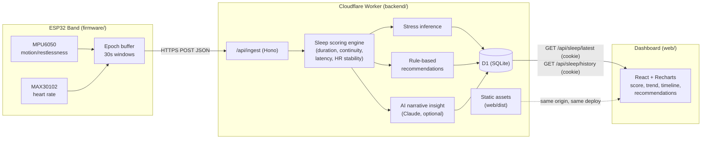

# Architecture

ZenSleep is a hardware-to-dashboard pipeline: a non-wearable-friendly band
captures raw motion + heart-rate signals, a backend turns them into a sleep
score and stress inference, and a web dashboard presents the result with
personalized recommendations. Everything server-side runs as a single
Cloudflare Worker - see [`deployment.md`](deployment.md).

## Why this shape

- **Epochs, not raw samples.** The wearable pre-aggregates into 30-second
  windows before sending, keeping payloads small and battery use low —
  matches the pitch's non-wearable-comfort and long-battery-life goals.
- **Scoring is deterministic and local to the backend**, not delegated to an
  LLM. The AI layer only adds a narrative gloss on top of numbers that are
  already trustworthy and explainable — important for a health-adjacent
  product where users (and investors) will ask "why this score?"
- **AI is additive, not load-bearing.** `backend/src/services/aiInsights.js`
  falls back to a template if no API key is configured, so the product works
  fully offline and the core IP (the scoring/stress-inference logic) doesn't
  depend on an external vendor.
- **The dashboard has no hardware dependency.** `/api/demo/generate` lets a
  logged-in user (and this whole repo) be demoed convincingly with zero
  physical devices, which matters for pitching to evaluators/investors who
  won't have a band on them. It's deliberately demoted in the UI to a small
  "try it with sample data" affordance rather than the primary call to
  action - real accounts and real (eventual) hardware data are the point.
- **One deployment, one origin.** The Worker serves both `/api/*` (Hono) and
  the built dashboard (Workers Static Assets, `run_worker_first: ["/api/*"]`
  in `backend/wrangler.jsonc`) - no CORS in production, no separate frontend
  host to keep in sync, no cold starts.

## Auth

Real accounts, not a `localStorage` demo ID:

- `POST /api/auth/signup` / `/login` hash the password with PBKDF2
  (`backend/src/services/password.js`, Web Crypto, 100k iterations, random
  per-user salt) and set a signed, httpOnly JWT cookie
  (`backend/src/services/session.js`, `hono/jwt` + `hono/cookie`, HS256,
  30-day expiry).
- `/api/sleep/*` and `/api/demo/*` require that cookie
  (`requireAuth` middleware) and always operate on the logged-in user - the
  API never accepts an arbitrary `userId` from the client for these routes,
  so one user can't read another's sleep data by guessing an ID.
- `/api/ingest` (the device path) is the one exception - a real ESP32 has no
  browser session to hand over, so it's still keyed by an explicit `userId`
  in the body. That's a known gap for when real hardware exists; see the
  comment in `backend/src/routes/ingest.js`.
- The cookie is `Secure` only when the request is actually HTTPS (checked
  per-request, not hardcoded), so it also works over plain `http://localhost`
  during local development.

## Where this diverges from the original pitch deck

The deck names AWS serverless + Firebase specifically. This implementation
uses Cloudflare Workers + D1 instead - same "serverless, no server to
manage" spirit, different vendor. `backend/src/db.js` is a small functional
interface, not an ORM; swapping the underlying store is a contained change
that doesn't touch scoring, routing, or the frontend. See
[`backend/README.md`](../backend/README.md).
