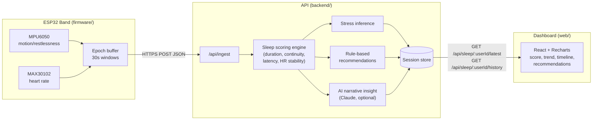

# Architecture

ZenSleep is a hardware-to-dashboard pipeline: a non-wearable-friendly band
captures raw motion + heart-rate signals, a backend turns them into a sleep
score and stress inference, and a web dashboard presents the result with
personalized recommendations.

## Why this shape

- **Epochs, not raw samples.** The wearable pre-aggregates into 30-second
  windows before sending, keeping payloads small and battery use low —
  matches the pitch's non-wearable-comfort and long-battery-life goals.
- **Scoring is deterministic and local to the backend**, not delegated to an
  LLM. The AI layer only adds a narrative gloss on top of numbers that are
  already trustworthy and explainable — important for a health-adjacent
  product where users (and investors) will ask "why this score?"
- **AI is additive, not load-bearing.** `backend/src/services/aiInsights.js`
  falls back to a template if no API key is configured, so the product works
  fully offline and the core IP (the scoring/stress-inference logic) doesn't
  depend on an external vendor.
- **The dashboard has no hardware dependency.** `/api/demo/:userId/generate`
  lets the web app (and this whole repo) be demoed convincingly with zero
  physical devices, which matters for pitching to evaluators/investors who
  won't have a band on them.

## Where this diverges from the original pitch deck

The deck names AWS serverless + Firebase specifically. This implementation
ships a small Express API and a local JSON datastore instead, so the whole
system runs with `npm install && npm start` and no cloud account — genuinely
useful for prototyping and demos. `backend/src/db.js` is a 4-function
interface; swapping it for DynamoDB/Firestore/Postgres is a contained change
that doesn't touch scoring, routing, or the frontend. See
[`backend/README.md`](../backend/README.md) for the swap point.
