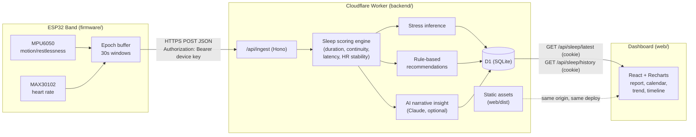

# Architecture

ZenSleep is a hardware-to-dashboard pipeline: a band captures raw motion +
heart-rate signals, a backend turns them into a sleep
score and stress inference, and a web dashboard presents the result with
personalized recommendations. Everything server-side runs as a single
Cloudflare Worker - see [`deployment.md`](deployment.md).

## Why this shape

- **Epochs, not raw samples.** The band pre-aggregates into 30-second
  windows before sending, keeping payloads small and battery use low —
  matches the pitch's comfort and long-battery-life goals.
- **Scoring is deterministic and local to the backend**, not delegated to an
  LLM. The AI layer only adds a narrative gloss on top of numbers that are
  already trustworthy and explainable — important for a health-adjacent
  product where users (and investors) will ask "why this score?"
- **AI is additive, not load-bearing.** `backend/src/services/aiInsights.js`
  falls back to a template if no API key is configured, so the product works
  fully offline and the core IP (the scoring/stress-inference logic) doesn't
  depend on an external vendor.
- **The dashboard doesn't require a live device connection.**
  `/api/demo/generate` seeds a realistic night so the product can be
  demoed convincingly without a band physically connected at that moment.
  It's deliberately demoted in the UI to a small "sample data" affordance
  rather than the primary call to action - real accounts and real device
  data are the point.
- **One deployment, one origin.** The Worker serves both `/api/*` (Hono) and
  the built dashboard (Workers Static Assets, `run_worker_first: ["/api/*"]`
  in `backend/wrangler.jsonc`) - no CORS in production, no separate frontend
  host to keep in sync, no cold starts.
- **History keeps summaries, not raw epochs.** `GET /api/sleep/history`
  deliberately excludes the `epochs` column (by far the largest per session)
  - the calendar and trend chart only need score/stress/metrics per night.
  Only `GET /api/sleep/latest` returns full epochs, so the motion timeline
  is only ever shown for the most recent night; browsing a past night via
  the calendar shows everything except that one chart, with an explicit
  note why (`web/src/components/SleepDetails.jsx`) rather than a
  silently-missing chart.

## Auth

Real accounts, not a `localStorage` demo ID:

- `POST /api/auth/signup` / `/login` hash the password with PBKDF2
  (`backend/src/services/password.js`, Web Crypto, 100k iterations, random
  per-user salt) and set a signed, httpOnly JWT cookie
  (`backend/src/services/session.js`, `hono/jwt` + `hono/cookie`, HS256,
  30-day expiry).
- `/api/sleep/*` and `/api/demo/*` require that cookie
  (`requireAuth` middleware) and always operate on the logged-in user - the
  API never accepts an arbitrary `userId` from the client for these routes,
  so one user can't read another's sleep data by guessing an ID.
- `/api/ingest` (the device path) uses a different mechanism entirely -
  the ESP32 has no browser session to hand over. `POST /api/devices`
  (cookie-authenticated, from the dashboard) generates a random 192-bit key
  (`backend/src/services/apiKey.js`), stores only its SHA-256 hash, and
  returns the raw key exactly once. The firmware sends it as
  `Authorization: Bearer <key>`; `requireDeviceAuth`
  (`backend/src/routes/devices.js`) hashes the presented key, looks up the
  owning device, and resolves the request to that device's user - the
  device never needs to know a user id, and revoking it
  (`DELETE /api/devices/:id`) invalidates the key immediately since the
  hash is simply deleted. Same fast-hash-for-lookup reasoning as API keys
  generally (GitHub, Stripe, etc.): the key is already high-entropy, so
  unlike passwords it doesn't need slow hashing to resist brute force.
- Each successful `/api/ingest` call updates the device's `lastSeenAt`,
  which is what lets the dashboard's "Your band" panel show a real
  online/offline status instead of just "registered".
- The cookie is `Secure` only when the request is actually HTTPS (checked
  per-request, not hardcoded), so it also works over plain `http://localhost`
  during local development.

## Where this diverges from the original pitch deck

The deck names AWS serverless + Firebase specifically. This implementation
uses Cloudflare Workers + D1 instead - same "serverless, no server to
manage" spirit, different vendor. `backend/src/db.js` is a small functional
interface, not an ORM; swapping the underlying store is a contained change
that doesn't touch scoring, routing, or the frontend. See
[`backend/README.md`](../backend/README.md).
